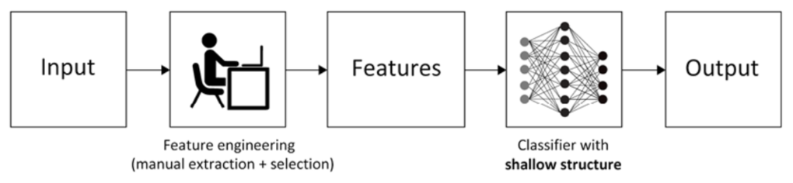

# Artificial Neural Networks

## Concepts

### Universal Approximation Theorem

We can always find a large enough neural network architecture with the right set of weights that can exactly predict any output for any given input.

### Deep Learning

- It has been proven that neural networks with one hidden layer are universal approximators
- In practice, the loss function is non-convex with respect to the weights, it is difficult to optimize
- Thus modern networks are often arranged in very deep networks

### Traditional ML vs Deep Learning Workflow

### Neuron/nodes

$$a = f(w_{0} + \sum_{i=1}^{n}{w_{i}x_{i}})$$