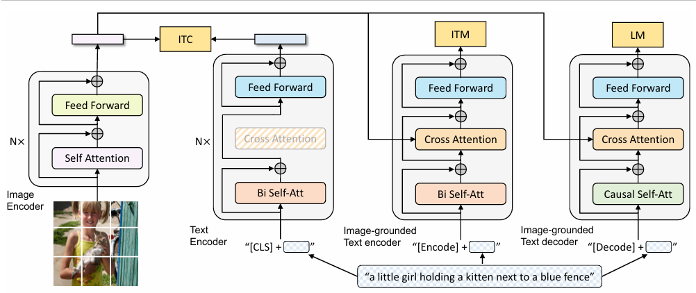
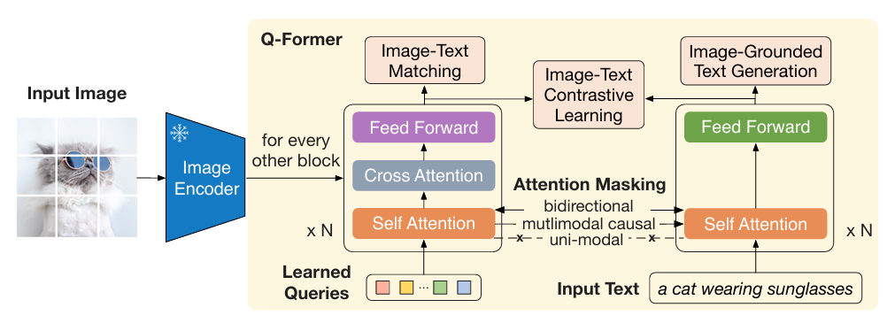

# CV + NLP

## Concepts
### Multimodality
#### Challenges
1. **Representation**: explores techniques to effectively summarize multimodal data, capturing the intricate connections among individual modality elements
2. **Alignment**: focuses on identifying connections and interactions across all elements
3. One modality may dominate others
4. Additional modalities can introduce noise
5. Full coverage over all modalities is not guaranteed
6. Different modalities can have complicated relationships

#### Paradigm
1. Pre-training the model with extensive training data
2. Fine-tuning the pre-trained model with task-specific data
3. Utilizing the trained model for downstream tasks such as classification

#### Tasks
1. **Visual Question Answering (VQA) & Visual Reasoning**

- In general, both VQA and Visual Reasoning are treated as VQA tasks
- Popular models: BLIP-VQA, Deplot, VLIT

**Visual Question Answering (VQA)**:
- Input: An image-question pair
- Output: 
    - Multiple-choice setting: A label corresponding to the correct answer among pre-defined choices
    - Open-ended setting: A free-form natural language answer based on the image and question
- Task: Answer questions about images (Most VQA models treat as a classification problem with pre-defined answers)

**Visual Reasoning**:
- Input:
    - VQA: Image-question pairs.
    - Matching: Images and text statements.
    - Entailment: Image and text pair (potentially with multiple statements).
    - Sub-question: Image and a primary question with additional perception-related sub-questions.
- Output:
    - VQA: Answers to questions about the image.
    - Matching: True/False for whether the text is true about the image(s).
    - Entailment: Prediction of whether the image semantically entails the text.
    - Sub-question: Answers to the sub-questions related to perception.
- Task: Performs various reasoning tasks on images

2. **Document Visual Question Answering (DocVQA)**

- Popular models: LayoutLM, Donut, Nougat
- Input:
    - Document image: A scanned or digital image of a document, containing text, layout, and visual elements
    - Question about the document: A natural language question posed in text format
- Output: Answer to the question: A text response that directly addresses the query and accurately reflects the information found in the document
- Task: 
    - Analyze and understand: The DocVQA model must process both the visual and textual information within the document to fully comprehend its content
    - Reason and infer: The model needs to establish relationships between visual elements, text, and the question to draw relevant conclusions
    - Generate a natural language answer: The model must produce a clear, concise, and accurate answer to the question in natural language text format

3. **Image Captioning**

- Popular models: ViT-GPT2, BLIP-Image-Captioning, git-base
- Input:
    - Image
    - Pre-trained image feature extractor (optional)
- Output: Textual captions: single sentence or paragraph that accurately describe the content of the input images, capturing objects, actions, relationships, and overall context
- Task: To automatically generate natural language descriptions of images
    1. Understanding the visual content of the image (objects, actions, relationships)
    2. Encoding this information into a meaningful representation
    3. Decoding this representation into a coherent, gramatically correct, and informative sentence or phrase

4. **Image-Text Retrieval**

- Popular models: CLIP
- Input: 
    - Images
    - Text: Natural language text, usually in the form of captions, descriptions, or keywords associated with images
- Output:
    - Relevant images: When a text query is given, the system returns a ranked list of images most relevant to the text
    - Relevant text: When an image query is given, the system returns a ranked list of text descriptions or captions that best describes the image
- Task:
    - Image-to-text retrieval: Given an image as input, retrieve text descriptions or captions that accurately describe its content
    - Text-to-image retrieval: Given a text query, retrieve images that visually match concepts and entities mentioned in the text

5. **Visual Grounding**

- Popular models: OWL-ViT, Grounding DINO
- Input: 
    - Image: A visual representation of a scene or object
    - Natural language query: A text description or question that refers to a specific part of the image
- Output: Bounding box or segmentation mask
- Task: Locating the relevant object or region

6. **Text-to-Image Generation**

**Auto-regressive Models**:
- Treat the task like translating text descriptions into sequences of image tokens
- Image tokens created by image tokenizers like VQ-VAE, represent basic image features
- Uses an encoder-decoder architecture:
    - Encoder: extracts information from the text prompt
    - Decoder: guided by this information, predicts one image token at a time, gradually building the final image pixel by pixel
- Allows for high control and detail, but faces challenges in handling long, complex prompts and can be slower than alternative methods like diffusion models

**Stable Diffusion Models**:
- Uses "Latent Diffusion" technique, where it build images from noise by progressively denoising it, guided by a text prompt and a frozen CLIP text encoder
- Its light architecture with a UNet backbone and CLIP encoder allows for GPU-powered image generation, while its latent focus reduces memory consumption

### Visual Language Models (VLMs)
#### Vision-Language Pretrained Models

#### Mechanism
Given image-text pairs:
- Extract image and text features using text and image encoders
- Learn the vision-language correlation with certain pre-training objectives (divided into 3 groups):
    1. **Contrastive** objectives: to learn discriminative representations by pulling paired samples close and pushing others faraway in the embedding space 
    2. **Generative** objectives: to learn semantic features by training networks to generate image/text data
    3. **Alignment** objectives: align the image-text pair via global image-text matching or local region-word matching on embedding space
- With the learned vision-language correlation, VLMs can be evaluated on unseen data in a zero-shot manner

#### Strategies
- Translating images into embedding features that can be jointly trained with token embeddings
    - Images are divided into multiple smaller patches and each patch is treated as one token in the input sequence
    - e.g. VisualBERT, SimVLM
- Learning good image embeddings that can work as a prefix for a frozen, pre-trained language model
    - Don't change the language model parameters, instead learn an embedding space for images, such that it is compatible with the language model
    - e.g. Frozen, ClipCap
- Using a specially designed cross-attention mechanism to fuse visual information into layers of the language model
    - e.g. VisualGPT
- Combine vision and language models without any training
    - e.g. MAGiC

#### Evaluation
1. Zero-shot prediction
    - Directly apply pre-trained VLMs to downstream tasks without any task-specific fine-tuning
2. Linear probing
    - Freeze the pre-trained VLM and train a linear classifier to classify the VLM-encoded embeddings to measure its representation

#### Contrastive Loss
$$L = 1[y_i = y_j]||x_i - x_j||^2 + 1[y_i \neq y_j] \max{(0, \epsilon - ||x_i - x_j||^2)}$$
- If the samples are similar ($y_i = y_j$), then we minimize the term ($||x_i - x_j||^2$) that corresponds to their Euclidean distance
- If the samples are dissimilar ($y_i \neq y_j$), then we minimize the term ($\max{(0, \epsilon - ||x_i - x_j||^2)}$), that is equivalent to maximizing their Euclidean distance until some limit $\epsilon$

## Models
### Contrastive Language-Image Pre-training (CLIP)
*Learning Transferable Visual Models From Natural Language Supervision*

- Unimodal: pretrains and makes use of image and text features independently
- Utilizes an image-text contrastive object, to capture rich vision-language correspondence knowledge, enabling zero-shot predictions
- Outperformed ImageNet models on out-of-distribution tasks
- Unlikely to outperform a specialized, fine-tuned model
- Use cases: 
    - Zero-shot image classification
    - Similarity search
    - Diffusion models conditioning

### Bootstraping Language-Image Pre-training (BLIP)
*BLIP: Bootstraping Language-Image Pre-training for Unified Vision-Language Understanding and Generation*

**Architecture**:
1. **ViT**: Plain vision transformer featuring self-attention, feed-forward blocks, and a [CLS] token for embedding representation
2. **Unimodal Text Encoder**: Resembling BERT's architecture, it uses a [CLS] token for embedding and employs contrastive loss like CLIP, for aligning image and text representation
3. **Image-Grounded Text Encoder**: Substitutes the [CLS] with an [Encode] token. Cross-attention layers enable the integration of image and text embeddings, creating a multimodal representation. It employes a linear layer to assess the congruence of image-text pairs
4. **Image-Grounded Text Decoder**: Replacing the bidirectional self-attention with causal self-attention, this decoder is trained via cross-entropy loss in an autoregressive manner for tasks like caption generation or answering visual questions

**Pre-training Objective**:
1. **Image-Text Contrastive (ITC) Loss**: similar to CLIP, the encoders are trained to generate similar representations for similar image and text pairs and different representations for negative input pairs
2. **Image-Text Matching (ITM) Loss**: helps the text encoder to learn multimodal representation that captures the fine-grained alignment between vision and language. This is a binary classification task where the loss outputs 1 for a positive image-text pair and 0 for a negative pair
3. **Language Modeling (LM) Loss**: helps the text decoder generate text descriptions for the corresponding input image

**CapFilt: Caption & Filtering**:
1. Pretrain with noisy web data (alt-texts often don't accurately describe the visual content of the images) +  small but accurate human labeled data
2. Fine-tune ITC, ITM and LM back with human labeled data
3. Generate newer captions using LM on web data, filter using ITM and use them again to train your end-to-end network (containing ITC, ITM and LM)

### BLIP-2
*BLIP-2: Bootstrapping Language-Image Pre-training with Frozen Image Encoders and Large Language Models*
- Can we take off-the-shelf pretrained frozen image encoders and frozen LLMs and use them for vision language pretraining while still preserving their learned representations?
- BLIP-2 solves this problem by introducing a Query Transformer that helps generate the most informative visual representation corresponding to a text caption (from the frozen image encoder), which then is fed to a frozen LLM to decode accurate text descriptions

**Stage 1: Vision-Language Representation Learning**
1. An input image is passed through a frozen image encoder (any pretrained vision transformer)
2. Q-Former interacts with the frozen image encoder and generates visual representations that is the most relevant with the input text. Q-former consists of a image transformer and a text transformer are trained using the same set of objectives (ITC, ITM, LM losses) as in BLIP

**Stage 2: Bootstrap Vision-to-Language Generative Learning from a Frozen LLM**:
1. Input: image; Output: textual description of the image
2. Input image is passed through the frozen image encoder, followed by Q-Former's image transformer to spit out the output visual represenation $z$
3. Output image embedding is projected to a dimension same as the text embedding of LLM
4. The projected query embeddings are then prepended to the input text embeddings. They function as soft visual prompts that condition the LLM on visual representation extracted by the Q-Former
5. Two kinds of LLMs are being trained:
    - Decoder based: to generate text conditioned on $z$ (uses language modeling loss)
    - Encoder-decoder based: visual embedding is prepended to the text embedding and then conditioned to generate text (using a prefix language modeling loss)

### Multimodal Object Detection (OWL-ViT)
*Simple Open-Vocabulary Object Detection with Vision Transformers*
- Employes a linear projection of each output token to obtain per-object image embeddings
- Box coordinates are derived from token represenations through a small MLP
- After fine-tuning, OWL-ViT excels in open-vocabulary object detection 

### Tr-OCR
*TrOCR: Transformer-based Optical Character Recognition with Pre-trained Models*

**Workflow**:
1. We take an input and resize it to a fixed height and width.
2. Then, we divide the image into a set of patches.
3. We then flatten the patches and fetch embeddings corresponding to each patch.
4. We combine the patch embeddings with position embeddings and pass them through an encoder.
5. The key and value vectors of the encoder are fed into the crossattention of the decoder to fetch the outputs in the final layer.

### LayoutLM
*LayoutLM: Pre-training of Text and Layout for Document Image Understanding*

**Document layout analysis**: build a single model that is able to assign a value corresponding to each text within the document image.

**Workflow**:
1. We take an image of the document and extract the various words and
their bounding-box coordinates (x0, x1, y0, and y1) – this is doneusing tools that help in OCR where they provide not only the text but also the bounding box in which the text is present in the document.
2. We take the position embeddings corresponding to these bounding-box coordinates – position embeddings are calculated based on the bounding-box coordinates.
3. We add the embeddings corresponding to the various texts extracted (text embeddings in the above picture) where we pass the text through a tokenizer, which in turn is passed through a pre-trained Bidirectional Encoder Representation of Transformers (BERT)-like model.
4. During the training phase of the pre-trained LayoutLM, we randomly mask certain words (but not the position embeddings of those words) and predict the masked words given the context (surrounding words and their corresponding position embeddings).
5. Once the pre-trained LayoutLM model is fine-tuned, we extract the embeddings corresponding to each word by summing up the text embeddings of the word with the position embeddings corresponding to the word.
6. Next, we leverage Faster R-CNN to obtain the image embedding corresponding to the location of the word. We leverage image embedding so that we obtain key information regarding the text style (for example, bold, italics, or underlined) that is not available with OCR.
7. Finally, we perform the downstream task of extracting the keys and values corresponding to the image. In the case of document key value extraction, it translates to the task of named entity recognition, where each output word is classified as one of the possible keys or a value associated with a key.

### LayoutLMv3
*LayoutLMv3: Pre-training for Document AI with Unified Text and Image Masking*

**Workflow**:
1. Words are obtained from an image using a typical OCR parser.
2. The words are then converted into embeddings using the RoBERTa model.
3. The document is resized into a fixed shape and then converted into multiple patches.
4. Each patch is flattened and passed through a linear layer to obtain embeddings corresponding to the patch.
5. The 1D position embeddings correspond to the index of the word/patch while the 2D position embeddings correspond to thebounding box/segment.
6. Once the embeddings are in place, we perform masked pre-training (MLM Head) in a manner similar to that of LayoutLM, where we mask certain words and predict them using the context. Similarly in masked image modeling (MIM Head), we mask certain blocks and predict the tokens within the block.
7. Word patch alignment (WPA Head) is then performed, which refers to the task of predicting whether a masked image patch has the corresponding tokens masked. If a token is masked and the corresponding image patch is masked, it is aligned; it is unaligned if one of these is masked and the other isn’t