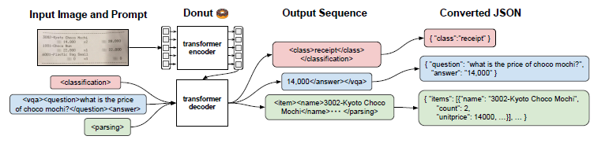

# End-to-end pipeline for document recognition

## Document AI
### Tasks
1. **Document Layout Analysis**: object detection task for document images
    - **Definition**: process of automatic analysis, recognition and understanding of images, text, table/figure/chart information and positional relationships in the document layout
    - Faster R-CNN, Mask R-CNN, SSD, YOLO
    - basic units: e.g. headings, paragraphs, tables, figures, charts
    - large-scale weakly supervised document layout analysis datasets: PubLayNet, PubTabNet, TableBank, DocBank

<!--  -->

2. **Visual Information Extraction**
    - **Definition**: extract entities and their relationships from a large amount of unstructured content in a document
    - **Visually rich documents**: text data whose semantic structure is not only determined by the content of the text, but also related to visual elements, such as layout, typesetting formats as well as table/figure structures

3. **Document VQA**
    - similar goal to RAG
<!-- 
 -->

4. **Document Image Classification**

## Visual Information Extraction (VIE)
Deep-learning-based VIE methods can be catergorized as:
1. Grid-based methods
2. GNN-based methods
3. Large scale pre-trained models
4. End-to-end methods
5. Few-shot methods
6. LLM-based methods

### Grid-based methods
- Treat the document as a 2D matrix, with text embeddings filling the pixels inside the text bounding box
- Computationally efficient, may not fully exploit the features of text regions in small sizes
- External OCR model

**Open-source models**:
- Chargrid: *Katti et al. Chargrid: Towards Understanding 2D Documents. EMNLP, 2018.*
- ViBERTgrid: *Lin et al. ViBERTgrid: A Jointly Trained Multi-Modal 2D Document Representation for Key Information Extraction from Documents. ICDAR, 2021*

### GNN-based methods
- Consider text segments as graph nodes and encode the relations between segment coordinates for edge representations
- Good balance between cost and performance
- Inherent characteristics of GNN, such as over-smoothing and gradient vanishing, makes the training process challenging
- External OCR model

**Open-source models**:
- PICK: *Yu et al. PICK: Processing Key Information Extraction from Documents using Improved Graph Learning-Convolutional Networks. ICPR, 2020*
- GraphDoc: *Zhang et al. Multimodal Pre-training Based on Graph Attention Network for Document Understanding. arXiv preprint, 2022*
- GeoContrastNet: *Nil Biescas, et al. GeoContrastnet: Contrastive Key-value Edge learning for Luanguage-Agnostic Document Understanding. ICDAR, 2024.*

### Large scale pre-trained models
- Leverage pre-training with a large amount of data to obtain effective generic models
- Computationally expensive

**Open-source models**:
- LayoutLMv3: *Huang et al. LayoutLMv3: Pre-training for Document AI with Unified Text and Image Masking. ACMMM, 2022.*
- LiLT: *Jiapeng Wang, Lianwen Jin and Kai Ding. LiLT: A Simple yet Effective Language-Independent Layout Transformer for Structured Document Understanding. ACL, 2022.*
- StrucTexT: *Li et al. StrucTexT: Structured Text Understanding with Multi-Modal Transformers. ACMMM, 2021.*
- DocFormer: *Appalaraju et al. DocFormer: End-to-End Transformer for Document Understanding. ICCV, 2021.*
- StructuralLM: *Li et al. StructuralLM: Structural Pre-training for Form Understanding. ACL, 2021.*
- BROS: *Hong et al. BROS: A Pre-Trained Language Model Focusing on Text and Layout for Better Key Information Extraction from Documents. AAAI, 2022.*
- ERNIE-Layout: *Peng et al. ERNIE-Layout: Layout Knowledge Enhanced Pre-training for Visually-rich Document Understanding. EMNLP Findings, 2022.*
- GeoLayoutLM: *Luo et al. GeoLayoutLM: Geometric Pre-training for Visual Information Extraction. CVPR, 2023.*

### End-to-end methods
- To reduce OCR error accumulation
- New

**Open-source models**:
- TRIE: *Zhang et al. TRIE: End-to-End Text Reading and Information Extraction for Document Understanding. ACMMM, 2020.*
- Donut: *Kim et al. OCR-free Document Understanding Transformer. ECCV, 2022.*
- Dessurt: *Davis et al. End-to-end Document Recognition and Understanding with Dessurt. ECCV, 2022*
- StrucTexTv2: *Yu et al. StrucTexTv2: Masked Visual-Textual Perdiction for Document Image Pre-training. ICLR, 2023.*
- Kuang CFAM: *Kuang et al. Visual Information Extraction in the Wild: Practical Dataset and End-to-end Solution. ICDAR, 2023.*
- Pix2Struct: *Lee et al. Pix2Struct: Screenshot Parsing as Pretraining for Visual Language Understanding. ICML, 2023.*
- UDOP: *Tang et al. Unifying Vision, Text, and Layout for Universal Document Processing. CVPR, 2023.*

### Few-shot methods
- Only a small number of samples
- New

**Open-source models**:
- N/A

### LLM-based methods
- Prompt engineering, fine-tuning
- Multi-image document understanding

**Open-source models*:
- mPLUG-DocOwl: *Ye et al. mPLUG-DocOwl: Modularized Multimodal Large Language Model for Document Understanding. arXiv preprint 2307.02499, 2023.*
- UReader: *Ye et al. UReader: Universal OCR-free Visually-situated Language Understanding with Multimodal Large Language Model. EMNLP Findings, 2023.*
- Monkey: *Li et al. Monkey: Image Resolution and Text Label Are Important Things for Large Multi-modal Models. CVPR, 2024.*
- OmniParser: *Wan et al. OmniParser: A Unified Framework for Text Spotting, Key Information Extraction and Table Recognition. CVPR, 2024.*
- LayTextLLM: *Lu et al. LayTextLLM: A Bounding Box is Worth One TokenInterleaving Layout and Text in a Large Language Model for Document Understanding. arXiv, 2024.*

## Potential Solutions: Document AI

### Problems
1. Current end-to-end models only consist the landmark detection & the OCR part, not including the segmenation module.
2. Licensing: non-commercial use
3. Latency?

### What end-to-end model solves
1. Layout analysis (one-for-all documents)
2. Joint optimization
3. Unified evaluation
4. Mitigating error propagation
6. VQA?

### Donut (Document understanding transformer)


**Contributions**:
1. OCR-free approach
2. Pre-training with SynthDoG (their own synthetic dataset generator)

**Model**:
- Transformer-based visual encoder and textual decoder
- Visual encoder (Swin Transformer) for extracting features from a given document image
- Textual decoder (BART) maps the derived features into a sequence of subword tokens to construct a desired structured format (e.g. JSON)
- Model input: teacher-forcing; generate token sequence given prompt
- Output conversion: output token sequence --> JSON
- Metrics: field-level F1 score, Tree Edit Distance

**Example**:

```json
{"predictions": [{
   "surname": "Berthier",
   "name": "Corinne",
   "sex": "F",
   "birthday": "12/06/1965",
   "birthplace": "Paris 1er (75)"
}]}
```

### LayoutLMv3


**Modifications**:
- Multi-task learning approach: attach head for detection and OCR
- Input: whole image, bbox (toggle OCR=False), type, text
- Output: bbox (for scan quality check), type, text

**Example**:


## Misc.
### Datasets
- MIDV
- IAM


### TO-DO
- Metrics
- Parameter size, latency (inference speed)

### API services
- Regula Forensics
- Google Document AI
- Azure AI Document Intelligence
- Amazon Textract

## References
- https://github.com/SCUT-DLVCLab/Document-AI-Recommendations/blob/main/Approaches/approaches_vie.md
- https://medium.com/@paul_lefevre/information-extraction-from-id-documents-with-donut-792ca80d2a93
- https://www.nidc.dk/en/Document-Database/ID-databases
- https://github.com/PaddlePaddle/PaddleOCR/blob/release/2.3/doc/doc_en/pgnet_en.md
