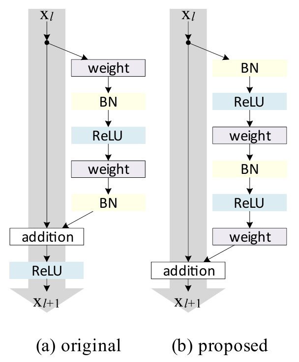
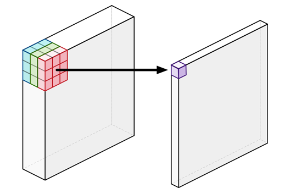
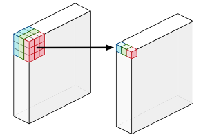
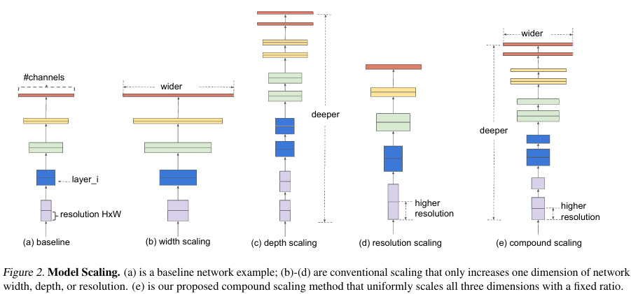
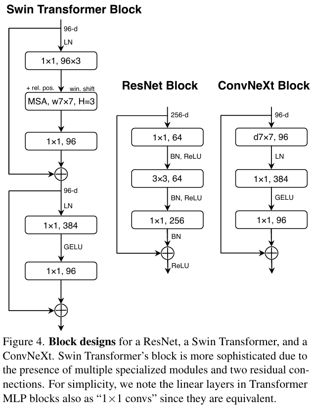
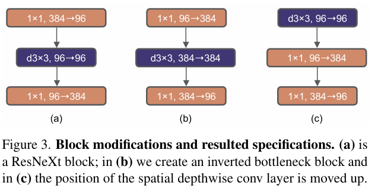
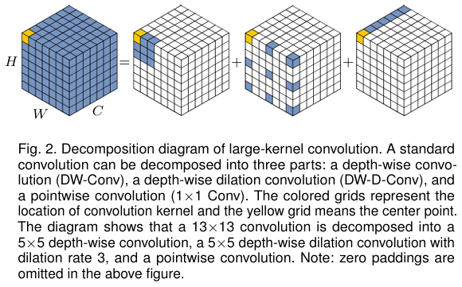
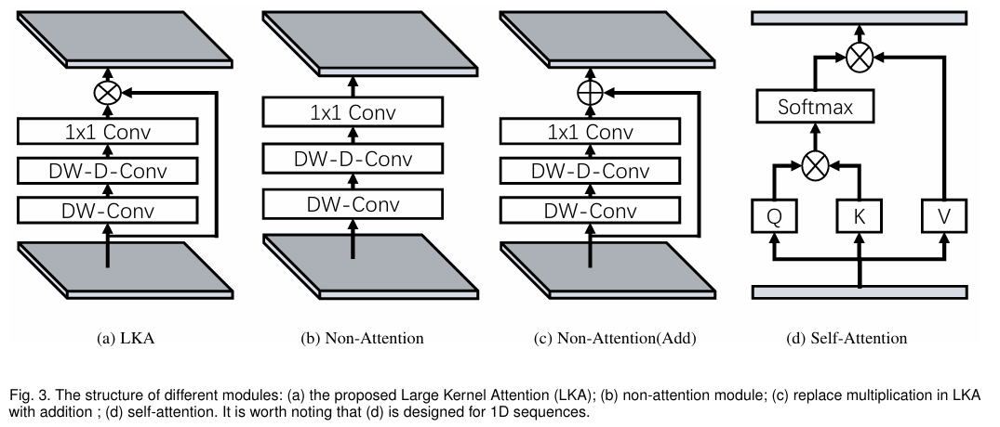
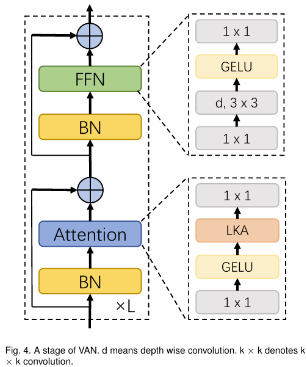

# CNN Models

## ResNet

### Deep Residual Learning for Image Recognition

### Identity Mappings in Deep Residual Networks

    

The major differences between ResNetV1 and ResNetV2 are as follows:

- ResNetV1 adds the second non-linearity after the addition operation is performed between the $\textbf{x}$ and $\textbf{F(x)}$. ResNetV2 has removed the last non-linearity, thus clearing the path of the input to output in the form of identity connection.
- ResNetV2 applies Batch Normalization and ReLU activation to the input before the multiplication with the weight matrix (convolution operation). ResNetV1 performs the convolution followed by Batch Normalization and ReLU activation.

### Resnet strikes back: An improved training procedure in timm

## MobileNet

### MobileNets: Efficient Convolutional Neural Networks for Mobile Vision Applications

- Designed for mobile devices
- **Depthwise Separable Convolutions:** achieves high accuracy while minimizng computational overhead
- **Channel-wise Linear Bottleneck Layers:** help to further reduce the number of parameters and computational cost while maintaining high accuracy

#### Depthwise Separable Convolutions

- Depthwise Convolution + Pointwise Convolution

1. **Standard convolution**

- Combines the values of all the input channels
- e.g. 3 channels --> 1 channel per pixel

2. **Depthwise convolution**

- Does not combine the input channels
- Convolves on each channel separately
- e.g. 3 channels --> 3 channels

3. **Pointwise convolution**

- Same as a standard convolution, except using a $1 \times 1$ kernel
- Adds up the channels from depthwise convolution as a weighted sum

#### Channel-wise Linear Bottleneck Layers

**3 main operations applied sequentially:**

1. **Depthwise convolution**: This step performs a convolution separately for each channel (a single color or feature) in the input image using a small filter (usually 3x3). The output of this step is the same size as the input but with fewer channels
2. **Batch normalization**: This operation normalizes the activation values across each channel, helping to stabilize the training process and improve generalization performance
3. **Activation function**: Typically, a ReLU (Rectified Linear Unit) activation function is used after batch normalization to introduce non-linearity in the network

### MobileNetV2: Inverted Residuals and Linear Bottlenecks

### Searching for MobileNetV3

## DenseNet

## ShuffleNet

## SENet

## SqueezeNet

## EfficientNet

### EfficientNet: Rethinking Model Scaling for Convolutional Neural Networks

Conventional techniques of model scaling is arbitrary, it requires manual tuning and still often yields sub-optimal performance:

1. Depth-wise
2. Width-wise
3. Scale up image resolution

#### Compound Model Scaling

$$\text{depth}: d = \alpha^{\phi}$$
$$\text{width}: w = \beta^{\phi}$$
$$\text{resolution}: r = \gamma^{\phi}$$
$$\text{s.t.}~ \alpha \cdot \beta^{2} \cdot \gamma^{2} \approx 2$$
$$\alpha \geq 1, \beta \geq 1, \gamma \geq 1$$

- Use a compound coefficient $\phi$ to uniformly scale network width, depth, and resolution
- The intuition for the network is, if the input image is bigger, them the network needs more layers to increase the receptive field and more channels to capture more fine-grained patterns on the bigger image
- FLOPS of a regular convolution operation is proportional to $d, w^2, r^2$
- Scaling a ConvNet will approximately increase total FLOPS by $(\alpha \cdot \beta^{2} \cdot \gamma^{2})^{\phi} \approx 2^{\phi}$

#### Architecture

EfficientNet-B0 is searched through neural architecture search, its architecture is similar to Mnas-Net

Starting from EfficientNet-B0, scale up:

1. Fix $\phi = 1$, do grid search of $\alpha, \beta, \gamma$
2. Fix $\alpha, \beta, \gamma$, scale up the baseline network with different $\phi$

### EfficientNetV2: Smaller Models and Faster Training

#### Bottlenecks of Efficient Net

1. **Training with very large image sizes is slow**
2. **Depthwise convolutions are slow in early layers**
3. **Equally scaling up every stage is sub-optimal**

#### Training-Aware NAS and Scaling

#### Progressive Learning

- partially inspired by curriculum learing, which schedules training examples from easy to hard

## ResNeXt

### Aggregated Residual Transformations for Deep Neural Networks

## RegNet

## NASNet

## InceptionNet

## ConvNeXt

### A ConvNet for the 2020s

#### Introduction

- Without the ConvNet inductive biases, a vanilla ViT's global attention has a quadratic complexity with respect to the input size
- Hierachical Transformers, e.g. Swin Transformer's "sliding-window" strategy (e.g. attention within local windows) revealed that: **The essence of convolution is not becoming irrelevant; rather, it remains much desired and has never faded**

#### Training Techniques

Inspired by DeiT and Swin Transformers:

1. **Epochs:** from 90 epochs to 300 epochs
2. **Optimizer:** AdamW optimizer instead of Adam optimizer, which differs in how it handles weight decay
3. **Data augmentation:** Mixup, Cutmix, RandAugment, Random Erasing
4. **Regularization:** Stochastic Depth and Label Smoothing

This enhanced training recipe increased the performance of the ResNet50 model from 76.1% to 78.8%, implying that a significant portion of the performance difference between traditional ConvNets and vision Transformers may be due to the training techniques

#### Macro Design

Swin Transformers follow ConvNets and use a multi-stage design, where each stage has a different feature map resolution

1. **Changing stage compute ratio**
   1. ResNet50 has 4 main stages with (3,4,6,3) blocks: a compute ratio of 3:4:6:3
   2. To follow Swin Transformer's compute ratio of 1:1:3:1, ConvNeXt adjusted the number of blocks on each stage of ResNet50 from (3,4,6,3) to (3,3,9,3)
   3. Changing the stage compute ratio improves the model accuracy from 78.8% to 79.4%
2. **Changing stem to "Patchify"**
   1. The "stem" cell dictates how the input images will be processes at the network's beginning
   2. Due to the redundancy inherent in natural images, a common stem cell will aggresively downsample the input images to an appropriate feature map size in both standard ConvNets and ViTs
   3. At the start of ResNet, the input is fed to a stem of $7 \times 7$ convolution layer with stride 2, followed by a max pool, used to downsample the image by a factor of 4
   4. Substiting the stem with a convolutional layer featuring a $4 \times 4$ kernel size and a stride of 4 is more effective, effectively convolving them through non-overlapping $4 \times 4$ patches
   5. Patchify serves the same purpose of downsampling the image by a factor of 4 while reducing the number of layers, it slightly improves the model accuracy from 79.4% to 79.5%

#### ResNeXt-ify

- ResNeXt demonstrates an improved trade-off between the number of floating-point (FLOPs) and accuracy compared to a standard ResNet
- The core component is grouped convolution, where the convolutional filters are separated into different groups
- ConvNeXt uses depthwise convolution, a special case of grouped convolution where the number of groups equals the number of channels
- Depthwise convolution is similar to the weighted sum operation in self-attention, which operates on a per-channel basis, i.e. only mixing information in the spatial dimension
- Depthwise convolution reduces the network FLOPs and the accuracy
- Following ResNeXt, ConvNeXt increases the network width from 64 to 96, the same number of channels as Swin-T
- This modification improves the model accuracy from 79.5% to 80.5%

#### Inverted Bottleneck

    

- An important aspect of the Transformer block is the inverted bottleneck, i.e. the hidden dimension of the MLP block is four times wider than the input dimension
- Despite the increased FLOPs for the depthwise convolution layer, the inverted bottleneck design reduces the whole ConvNeXt network FLOPs to 4.6G
- Slightly improves the performance from 80.5% to 80.6%

#### Larger Kernel Size

    

- ViT's non-local self-attention allows a broader receptive field of image features
- Swin Transformers' attention block window size is set to at least $7 \times 7$, surpassing the $3 \times 3$ kernel size of ResNeXt
- **Move up the depthwise convolution layer**
- The repositioning enables the $1 \times 1$ layers to efficiently handle computational tasks, while the depthwise convolution layer functions as a more non-local receptor
- By using a larger kernel size, ConvNeXt's performance increases from 79.9% ($3 \times 3$) to 80.6 ($7 \times 7$)

#### Micro Design

1. **Activation:** Replacing ReLU with GELU, and eliminating all GELU layers from the residual block except for one between two $1 \times 1$ layers
2. **Normalization:** Fewer normalization layers by removing two BatchNorm layers, and substituting BatchNorm with LayerNorm, leaving only one LayerNorm layer before the conv $1 \times 1$ layers
3. **Downsampling Layer:** Add a separate downsample layer in between ResNet stages

- These modifications improve the ConvNeXt accuracy from 80.6% to 82.0%
- The final ConvNeXt model exceeds Swin Transformer's accuracy of 81.3%

## VAN

### Visual Attention Network

#### Introduction

Applying self-attention in computer vision is challenging:
1. Treating images as 1D sequences neglects their 2D structures
2. The quadratic complecity is too expensive for high-resolution images
3. It only captures spatial adaptability but ignores channel adaptability

#### Large Kernel Attention (LKA)

- Enable self-adaptive and long-range correlations in self-attention while avoiding its short-comings
- A large kernel convolution operation is decomposed to capture long-range relationship
- Specifically a $K \times K$ convolution is decomposed into a $\left\lceil \frac{K}{d} \times \frac{K}{d} \right\rceil$ depth-wise dilation convolution with dilation $d$, a $(2d-1) \times (2d-1)$ depth-wise convolution and a $1 \times 1$ convolution

**LKA Module:**

$$Attention = \text{Conv}_{1 \times 1}(\text{DW-D-Conv(DW-Conv(F))})$$

$$Output = Attention \otimes F$$

- $F \in \mathbb{R}^{C \times H \times W}$ is the input feature
- $Attention \in \mathbb{R}^{C \times H \times W}$ denotes attention map

#### Visual Attention Network (VAN)

- Simple hierarchical strucure, i.e. a sequence of four stages with decreasing output spatial resolution
- With the decreasing of resolution, the number of output channels is increasing