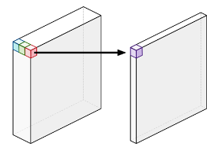

# CNN Models

## ResNet & ResNetV2

## MobileNet

### MobileNets: Efficient Convolutional Neural Networks for Mobile Vision Applications

- Designed for mobile devices
- Depthwise Separable Convolutions: achieves high accuracy while minimizng computational overhead
- Channel-wise Linear Bottleneck Layers: help to further reduce the number of parameters and computational cost while maintaining high accuracy

#### Depthwise Separable Convolutions

- Depthwise Convolution + Pointwise Convolution

1. **Standard convolution**

- Combines the values of all the input channels
- e.g. 3 channels --> 1 channel per pixel

2. **Depthwise convolution**

- Does not combine the input channels
- Convolves on each channel separately
- e.g. 3 channels --> 3 channels

3. **Pointwise convolution**

- Same as a standard convolution, except using a $1 \times 1$ kernel
- Adds up the channels from depthwise convolution as a weighted sum

### Channel-wise Linear Bottleneck Layers

**3 main operations applied sequentially:**

1. **Depthwise convolution**: This step performs a convolution separately for each channel (a single color or feature) in the input image using a small filter (usually 3x3). The output of this step is the same size as the input but with fewer channels
2. **Batch normalization**: This operation normalizes the activation values across each channel, helping to stabilize the training process and improve generalization performance
3. **Activation function**: Typically, a ReLU (Rectified Linear Unit) activation function is used after batch normalization to introduce non-linearity in the network

## Mobile-Former

### Mobile-Former: Bridging MobileNet and Transformer

1. Use MobileNet as a feature extractor, then fed into a transformer model
2. Training MobileNet and ViT separately and then combining their predictions through ensemble techniques

## DenseNet

## SqueezeNet

## EfficientNet

## ResNeXt

## NASNet

## InceptionNet

## InceptionResNet

## ConvNeXt

- A significatnt improvement to pure convolution models by incorporating techniques inspired by ViTs and achieving results comparable to ViTs in accuracy and scalability
- TO-DO
