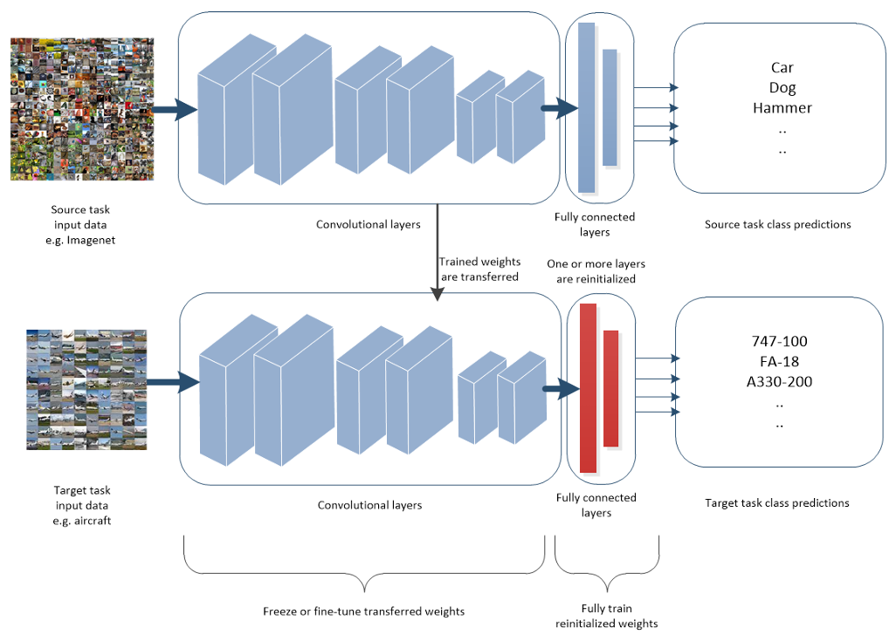
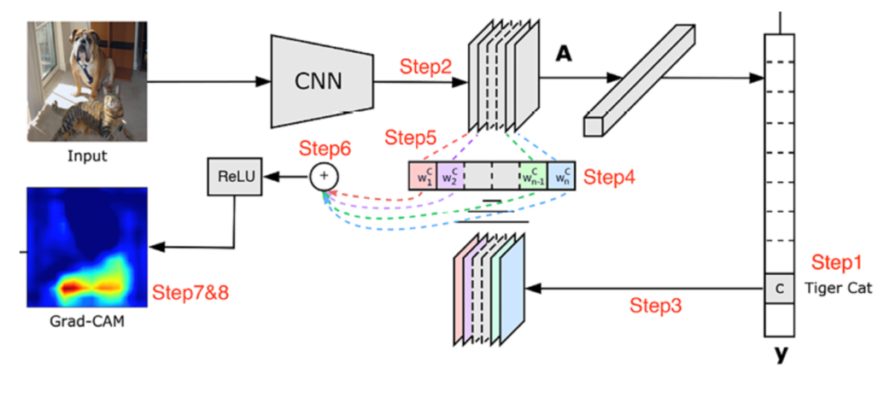

# Concepts

## Empirical Risk Minimization

We are interested finding a function $f$ that minimized the expected risk:

$$R_{TRUE}(f) = E[\mathcal{l}(f(x), y)] = \int \mathcal{l}(f(x), y) \, dp(x,y)$$

with the optimal function:

$$f^{*} = \argmin_{f}{R_{TRUE}(f)}$$

- $R_{TRUE}(f)$ is the true risk if we have access to an infinite set of all possible data and labels
- In practical, the joint probability distribution $P(x,y) = P(y|x)P(x)$ is unknown and the only available information is contained in the training set

Thus, the true risk is replaced by the empirical risk, which is the average of sample losses over the training set $D$:

$$R_n(f) = \frac{1}{n} \sum_{i=1}^{n}{\mathcal{l}(f(x_i), y_i)}$$

with attempting to find a function in $\mathcal{F}$ which minimizes the emprical risk:

$$f_{n} = \argmin_{f}{R_{n}(f)}$$

- $\mathcal{F}$ is a family of candidate functions
- In the case of CNNs, this involves choosing the relevant hyperparameters, model architecture, etc.

Thus finding a function that is as close as possible to $f^{*}$ can be broken down into:

1. Choosing a class of models that is more likely to contain the optimal function
2. Having a large and broad range of training examples in $D$ to better approximate an infinite set of all possible data and labels

## Deep transfer learning

- Given a source domain $\mathcal{D}_S$ and learning task $\mathcal{T}_S$, a target domain $\mathcal{D}_T$ and learning task $\mathcal{D}_T$
- Deep transfer learning aims to improve the performance of the target model $M$ on the target task $\mathcal{D}_T$ by initializing it with weights $W$
- Weights $W$ are trained on source task $\mathcal{T}_S$ using source dataset $\mathcal{D}_S$ (pretraining)
- Where $\mathcal{D}_S \neq \mathcal{D}_T$, or $\mathcal{T}_S \neq \mathcal{T}_T$
- With deep neural networks, once the weights have been pretrained to respond to particular features in a large source dataset, the weights will not change far from their pretrained values during fine-tuning

### Datasets commonly used in transfer learning for image classification

1. **Imagenet 1K, 5K, 9K, 21K:** different subset of classes, e.g. 21K has 21000 classes
2. **JFT:** internal Google Dataset

## Negative Transfer

- If the source dataset is not well related to the target dataset, the target model can be negatively impacted by pretraining
- Negative transfer occurs when NTG is positive
- Divergence between the source and target domains, the size and quality of the source and target datasets affect negative transfer

### Negative Transfer Gap (NTG)

$$NTG = \epsilon_{\tau}(\theta(S, \tau)) - \epsilon_{\tau}(\theta(\emptyset, \tau))$$

- $\epsilon_{\tau}$ as the test error on the target domain
- $\theta$ as the specific transfer learning algorithm
- $\emptyset$ as the case where the source domain data/information are not used by the target domain learner 

## Class Activation Map (CAM)

### Grad-CAM: Visual Explanations from Deep Networks via Gradient-based Localization

- If a certain pixel is important, then the CNN will have a large activation at those pixels
- If a certain convolutional channel is important with respect to the required class, the gradients at that channel will be very large

## Caveats

- **Imbalanced data**
  - Confusion matrix
  - Loss function (binary or categorical cross-entropy) ensures that the loss values are high when the amount of misclassification is high
  - Higher class weights to rare class image
  - Over-sample rare class image
  - Data augmentation
  - Transfer learning
- **The size of the object (small) within an image**
  - Object detection: divide input image into smaller grid cells, then identify whether a grid cell contains the object of interest
  - Model is trained and inferred on images with high resolution
- **Data drift**
- The number of nodes in the flatten layer
  - Typically around 500-5000 nodes
- **Image size**
  - Images of objects might not lose information if resized
  - Images of text might lose considerable information