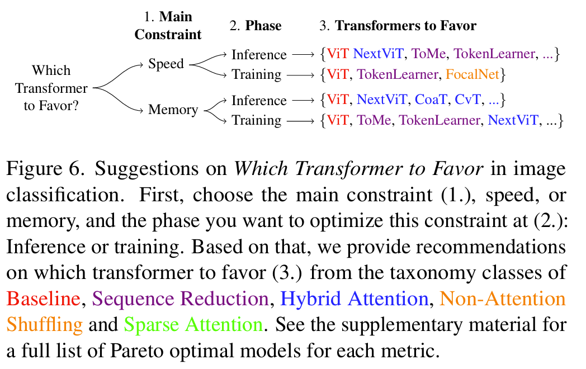

# Which Transformer to Favor

## Abstract

- Analyze the results based on the Pareto front - the boundary of optimal models
- Hybrid attention-CNN models exhibit remarkable inference memory and parameter-efficiency
- Our benchmark shows that using a larger model in general is more efficient than using higher resolution images

## Introduction

- Self-attention enables the Transformer to capture global dependencies between pairs of tokens, but it has a computational complexity of $\mathcal{O}(N^2)$ in the input length $N$, making it impractical for long sequences and high-resolution images
- We plot inference throughput against accuracy to visualize the Pareto front
- A model is Pareto optimal if and only if there is no model that is both more accuracte and faster at the same time

## Core Elements of ViT

$$A = \text{softmax} \left( \frac{QK^T}{\sqrt{d_{\text{head}}}} \right) \in \mathbb{R}^{N \times N}$$

$$X_{\text{out}} = AV = \text{softmax} \left( \frac{QK^T}{\sqrt{d_{\text{head}}}} \right)V$$

## Efficient Transformers for Vision

### Efficiency-Improving Changes

#### Token Mixing

1. **Low-rank attention**
2. **Sparse attention**
3. **Fixed attention**
4. **Kernel attention**
5. **Hybrid attention**
6. **Fourier attention**
   1. Uses FFT to reduce the complexity to $\mathcal{O}(N \log N)$
7. **Non-attention shuffling**

#### Token Sequence

1. Token removal
2. Token merging
3. Summary tokens

#### MLP Block

1. More MLPs