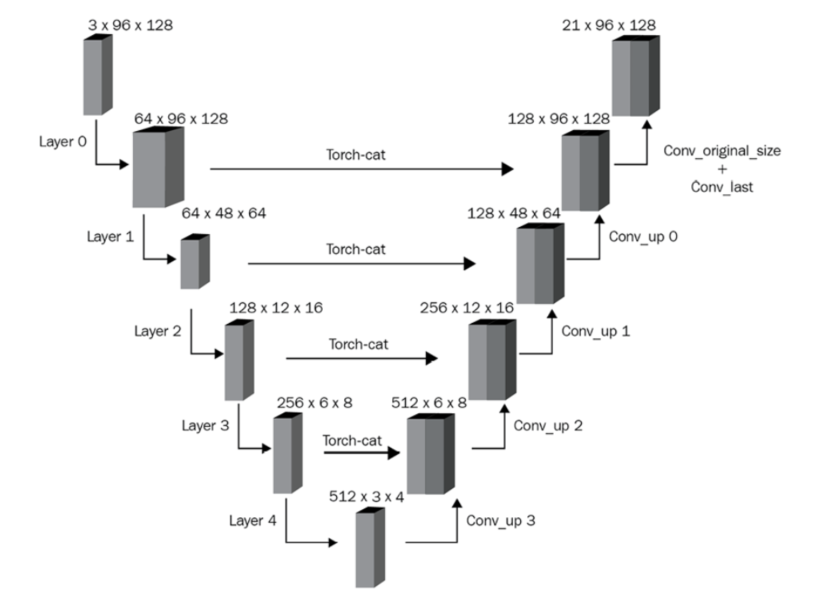
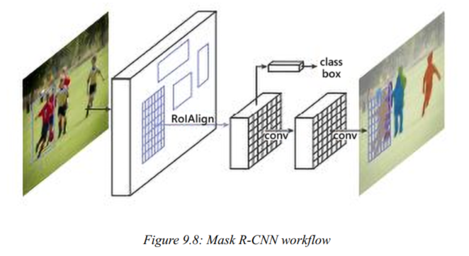
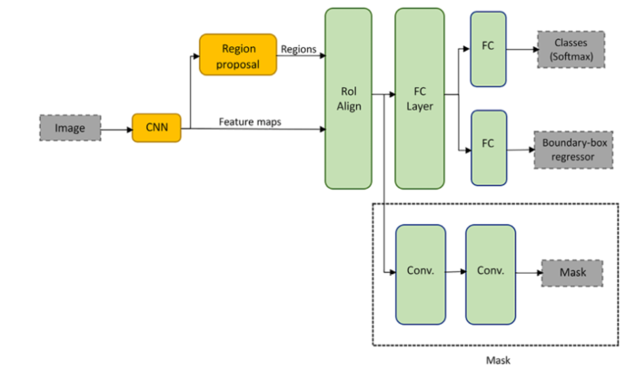

# Image Segmentation

## Models
### U-Net
*Convolutional Networks for Biomedical Image Segmentation*

- **Left half**: image size keeps reducing, channel size keeps increasing
- **Right half**: 
  - upscale the downscaled image, back to the original height and width but with as many channels as there are classes
  - leverage information from the corresponding layers in the left half using skip connections 

### Mask R-CNN
*Mask R-CNN*

- mask: 0 or 1, indicates whether the pixel contains an object or not

### SAM

### MaskFormer

### OneFormer

## Concepts
### Transposed Convolution
https://makeyourownneuralnetwork.blogspot.com/2020/02/calculating-output-size-of-convolutions.html
- Internally, padding is calculated as dilation * (kernel_size – 1) - padding. Hence, it is 1*(2-1)-0 = 1, where we add zero padding of 1 to both dimensions of the input array

**Convoultion output size**
$\text{output size} = \lfloor \frac{(\text{input size}) + 2*\text{padding} - (\text{kernel size - 1}) - 1}{\text{stride}} \rfloor$

**Transposed convolution output size**
$\text{output size} = (\text{input size} - 1)*\text{stride} - 2*\text{padding} + (\text{kernel size} - 1) + 1$

### RoI Align
https://erdem.pl/2020/02/understanding-region-of-interest-part-2-ro-i-align
- RoI Pooling has information loss, since certain parts of the region have more weight than others
- get a more accurate representation of the region proposal

### Fully Convolutional Network (FCN)
- e.g U-Net
- can accept inputs of any size
  - The reason is that when using a convolutional layer, you select the size of the filter kernels, which are independent of the image/layer input size (provided that images smaller than the kernels are padded appropriately).
  - once the kernel and step sizes are described, the convolution at each layer can generate appropriate dimension outputs according to the corresponding inputs
https://d2l.ai/chapter_computer-vision/fcn.html