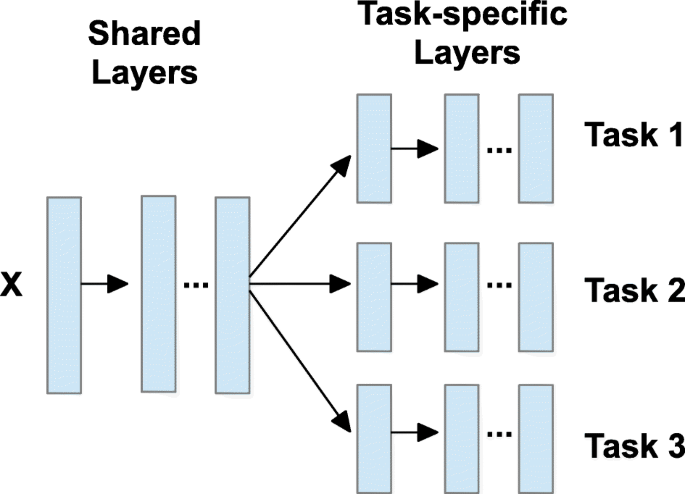
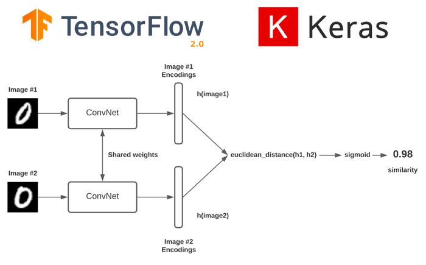

# Miscellaneous

## Concepts

### Multi-regression

- Prediction of multiple values given an image as input
- e.g. facial keypoint detection

### Multi-task learning

- Prediction of multiple items in a single shot
- e.g. age estimation and gender classification

### Self-training

- A semi-supervised technique where a model is intially trained on a labeled dataset
- Then it uses its own predictions on unlabeled data to iteratively improve itself
- After predicting labels for the unlabeled data, it takes the most confident predictions and retrains itself with this pseudo-labeled data

### Self-supervised learning

- A type of unsupervised learning
- The model generates labels from the data itself to create supervision signals

### Siamese network

- Takes in two separate inputs, processes each of the inputs with the same set of weights, and then compares the resulting outputs to determine how similar or dissimilar the two inputs are
- Loss functions: contrastive loss, triplet loss

### Teacher Forcing

- Primarily used in sequence prediction models
- When generating sequences, the model predics each element based on the previous elements
- In teacher forcing however, rather than using the model's own predictions as inputs for the next step, the true values from the training data are fed as inputs for each subsequent step

### Meta-Learning

### Zero-shot Computer Vision

### Ethics & Biases

### Neural Tangent Kernel (NTK)

### Hessian Matrix

## Models

### Mixup

### RandAugment

### I-JEPA

*Self-Supervised Learning from Images with a  Joint-Embedding Predictive Architecture*