# Data Augmentation

[https://arxiv.org/pdf/2301.02830](https://arxiv.org/pdf/2301.02830)

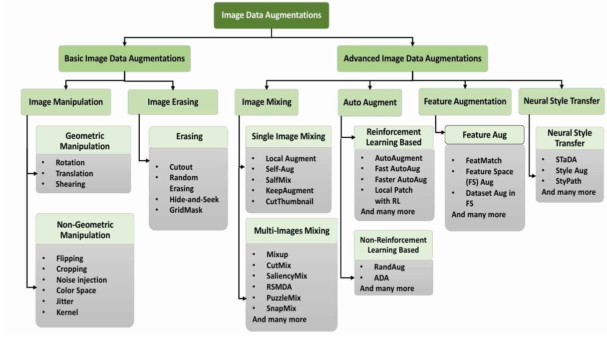

## Basic

### Image Manipulation

Refers to the changes made in an image with respect to its position or color

#### Geometric Manipulation

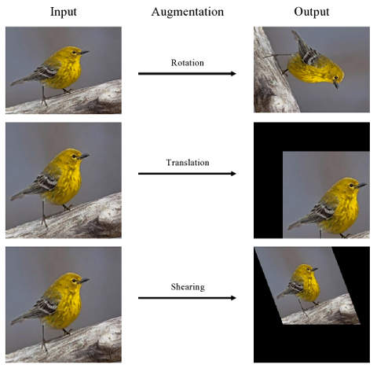

1. **Rotation:** rotate an image by a specified angle within the range of 0 to 360
2. **Translation:** shift an image in any of the upward, downward, right, or left directions
3. **Shearing:** shift one part of an image in one direction, while the other part is shifted in the opposite direction

#### Non-Geometric Manipulation

Focuses on modifications to the visual characteristics of an image, as opposed to its geometric shape

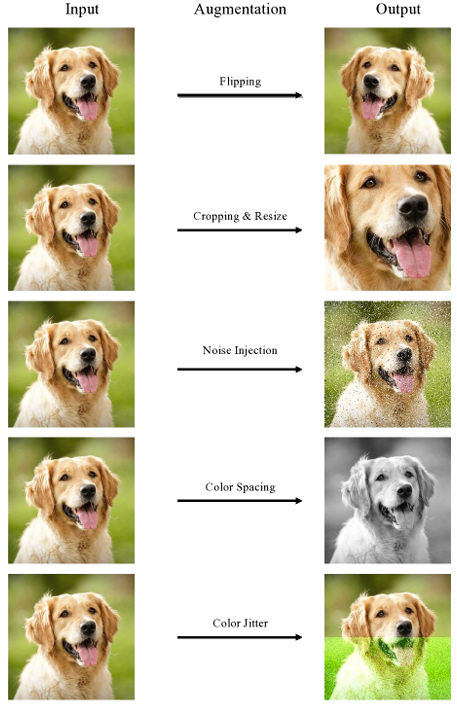

1. **Flipping:** flip an image either horizontally or vertically
2. **Cropping and resizing:** crop randomly or the center of the image, then resize to its original size
3. **Noise injection:** enhance the robustness of neural networks in learning features and defending against adversarial attacks
4. **Color Space (a.k.a. photometric augmentation):** the manipulation of individual channel values, can help to control the brightness of the image
5. **Jitter:** randomly altering the brightness, contrast, saturation, and hue
6. **Kernel Filter:** e.g. Gaussian-blur filter to soften the image; edge filter sharpens the edges either horizontally or vertically

### Image Erasing

Remove specific parts of an image and replacing them with either 0, 255, or the mean of the entire dataset

1. **Cutout:** random removal of a sub-region within an image, which is then filled with a constant value such as 0 or 255

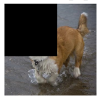

2. **Random Erasing:** similar to cutout, but it randomly determines whther to mask out region or not and also determines the aspect ratio and size of the masked region

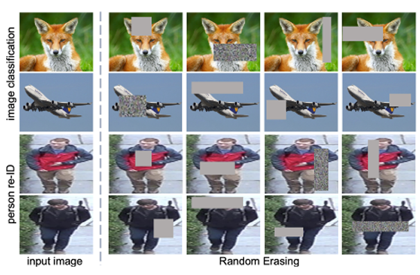

3. **Hide-and-Seek:** divide an image into uniform sqaures of random size and then randomly remove a specified number of these squares

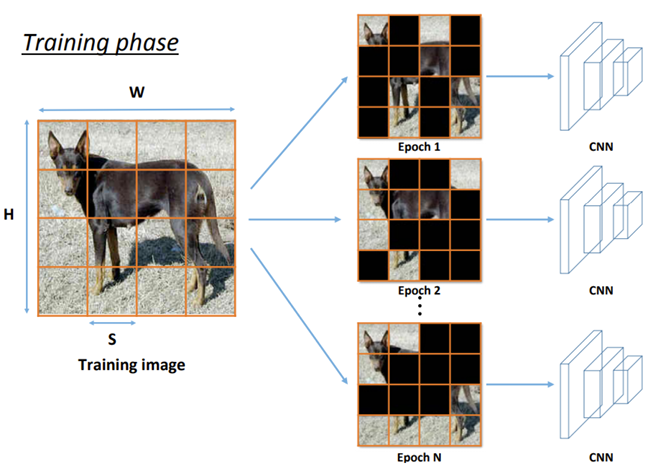

4. **GridMask:** uniform masking pattern, to address the challenges associated with randomly removing regions from images

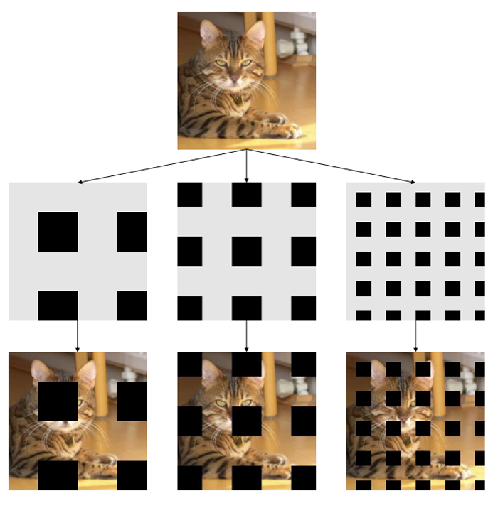

## Advanced

### Image Mixing

#### Single Image Mixing

1. **Local Augment:** divide an image into smaller patches, and applying different types of data augmentation to each patch; does not preserve the global structure of an image

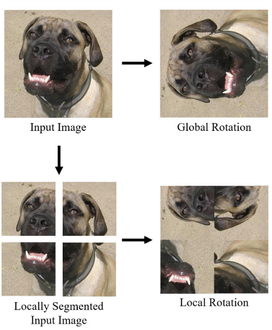

2. **Self-Aug:** a random region of an image is cropped and pasted randomly in the image, improving the generalization capability in few-shot learning; combines regional dropout and knowledge distillation

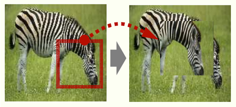

3. **SalfMix:** the first salient part of the image is found to decide which part should be removed and which portion should be duplicated; most salient regions are cropped and placed into non-salient regions

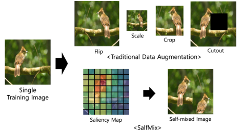

4. **KeepAugment:** increase fidelity by preserving the salient features of the image and augmenting the non-salient region; preserved features help to increase diversity without shifting the distribution

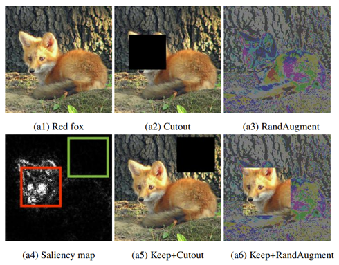

5. **CutThumbnail:**

#### Multi-Images Mixing

1. **Mixup:**
2. **CutMix:**
3. **SaliencyMix:**
4. **RSMDA:**
5. **PuzzleMix:**
6. **SnapMix:**

### Auto Augment

#### Reinforcement Learning Based

1. **AutoAugment:** each sub-policy has two parameters, one is the image processing function and the second one is the probability with magnitude

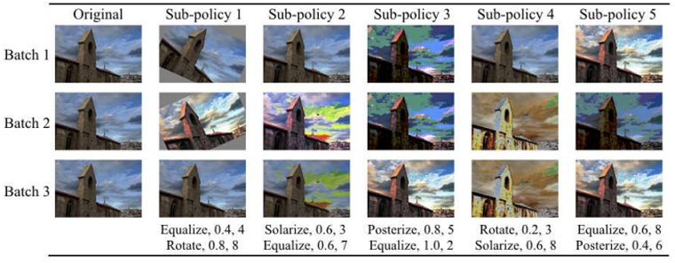

#### Non-Reinforcement Learning Based

1. **RandAugment:**

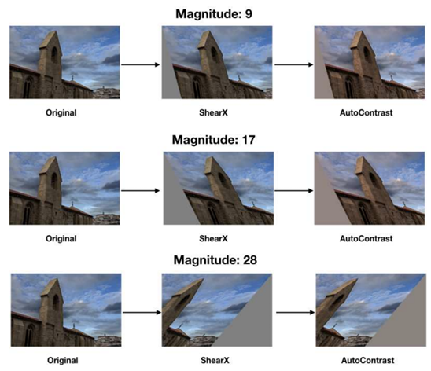

- Applies a series of random augmentations such as rotation, translation, and shear

## Feature Augmentation

## Neural Style Transfer