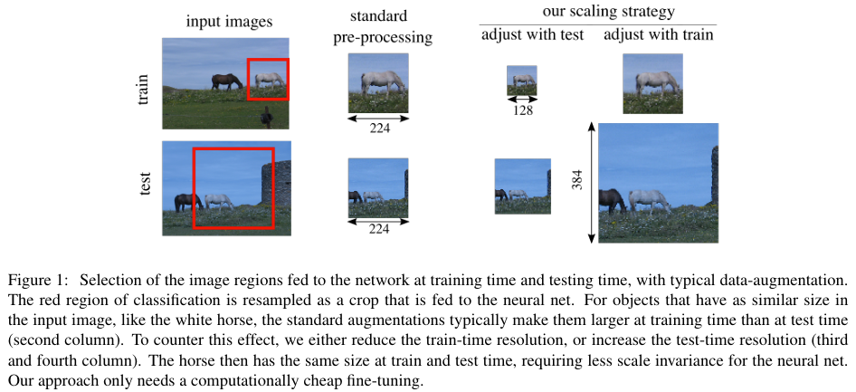

# Misc.

## FixRes: Fixing the train-test resolution discrepancy

- It is desirable to use a lower training resolution and fine-tune the network at the larger resolution
- This speeds up the full training and improves the accuracy under prevailing data augmentation schemes

### Train-Test Resolution Discrepancy

While the crops extracted at training and test time have the same size, they arise from different RoCs, which skews the distribution of data seen by the CNN

#### Train

- The training practice is to extract a rectangle with random coordinates from the image, which artificially increases the amount of training data. 
- This region is called the **Region of Classification (RoC)**

#### Test

- The RoC is instead set to a square covering the central part of the image, which results in the extraction of a so called **"center crop"**
- This reflects the bias of photographers who tend to center important visual content

### Strategy

## Determining the optimal sample size

- TODO