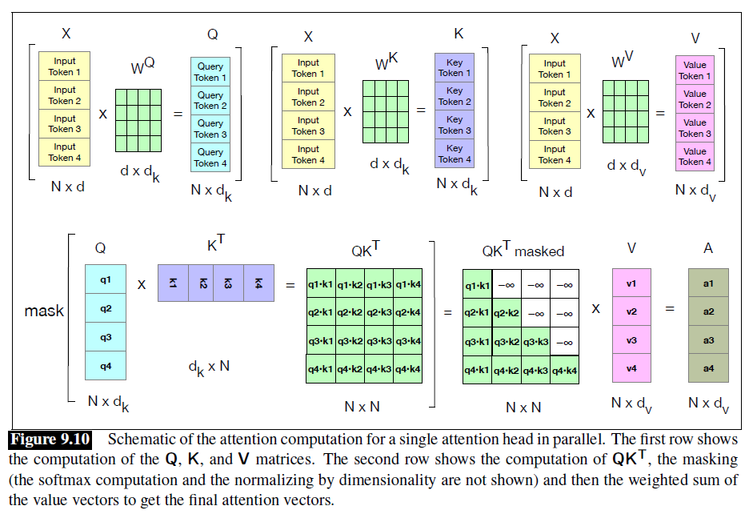

# Architecture

## Attention

### Standard Attention

### Self-Attention

$$\textbf{A} = \text{softmax}\left(\frac{\textbf{Q}\textbf{K}^\text{T}}{\sqrt{d_k}} \right) \textbf{V}$$

### Multi-Head Attention (MHA)

- Allows the model to focus on different parts of the input data simultaneously by employing multiple attention heads

### Multi-Query Attention (MQA)

- Simplifies MHA by using a single shared query across all heads
- But allowing different key and value projections
- Reduces complexity in both space and time

### Grouped-Query Attention (GQA)

- A variant of MHA that reduces computational complexity by sharing query representations across multiple heads
- While allowing separate key and value representations
- The idea is to use fewer query groups but still preserve a level of diversity in the attention mechanism

### Multi-Head Latent Attention (MLA)

- Achieves better results than MHA through low-rank key-value joint compression
- Requires much less Key-Value (KV) Cache

### Local/Sparse Attention

### Flash-Attention

## Feed-Forward Neural Network (FNN)

### Standard FNN

### Gated FNN

## Activation Function

### Rectified Linear Unit (ReLU)

### Gaussian Error Linear Unit (GELU)

### GELU-tanh

### SiLU (Sigmoid Linear Unit)

## Normalization

### BatchNorm

### LayerNorm

### RMSNorm

## Positional Embeddings

### Sinusoidal Position

### RoPE

## Misc.

### Parameter Sharing

### Layer-wise Parameter Scaling

### Nonlinearity Compensation

## Counterparts

### RNN

### LSTM

### Mamba

### RWKV
