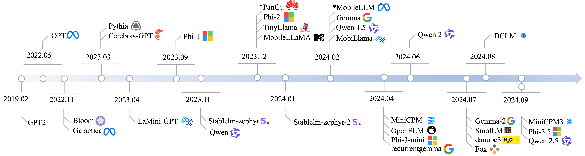

# Concepts

## Overview of SLMs

## Findings

### The number of training tokens vs. the size of model parameters

- The number of parameters in SLM models and the amount of data used for training (the number of tokens) are closely related, with the Chinchilla law suggesting that the optimal ratio between the number of model parameters and training tokens should be around 20 (e.g. a 1B model with 20B tokens)
- A notable observation is that SLMs are trained on much large number of tokens (typically over 1.5T) than what is suggested by the Chinchilla law, regardless of their parameter size
- SLMs are significantly "over-trained", as compared to the Chinchilla law
- The rationale behind this approach is to deploy powerful SLMs on resource-constrained devices by using more training-time FLOPs

### The amount of training tokens vs. model accuracy

- In general, there is a positive correlation between the two metrics, especially for those with less than 700B tokens
- The correlation is weak, since the data quality often outweights the impacts of more training tokens, espcecially when the training tokens exceed 1T
- The importance of data quality to the final SLM capability typically outweighs the data quantity and model architecture configurations

### Latency and memory

- Matrix by vector multiplication is the most time-consuming operations of SLM, which constiture more than 70% end-to-end inference time
- Context length is crucial for model runtime memory usage. When context length gets to 32,000m the KV cache will take up over 80% memory

## Quantization

The benefits of quantization for reducing inference latency on server-side GPUs likely stem from three factors:
1. Higher computational throughput of Tensor Cores for int8 operations
2. Reduced memory access overhead
3. Decrease in heat generated by reduced memory access

- On mobile devices, such as Jetson, support for int8 computation is lacking, but memory access overhead can still be reduced
- It comes from data compression due to the lower precision of activation values and parameters, which in turn improves cache utilization
- For the prefill phase, when the prompt length is relatively short, quantization can reduce latency by at least 25%. However, this benefit diminishes as the prompt length increases
- Quantization during the decode stage delivers more consistent performance gains, reducing decode latency by up to 75% and no less than 17%, because decode stage is more memory-bound
- More regular quantization precision leads to better performance. Altohugh 3-bit quantization offers a higher model compression rate, 4-bit quantizations performs better in both the prefill and decode stages. The inferior performance of 3-bit quantization is due to its irregular bit-width, which lacks hardware optimzation support and incurs additional overhead from data alignment and padding. As a results, despite its lower compression rate, 4-bit quantization is more efficient

### Methods

- **Qn_K (Qn_K_M):** the quantization of a model to $n$ bits using the $k$-quants methods with a medium (M) number of parameters
- **Qn_0:** symmetric quantization of a model to $n$ bits

## GGUF (GPT-Generated Unified Format)

- A powerful quantization format replacing GGML
- GGML is a C++ Tensor library designed for machine learning, facilitating the running of LLMs either on a CPU alone or in tandem with a GPU