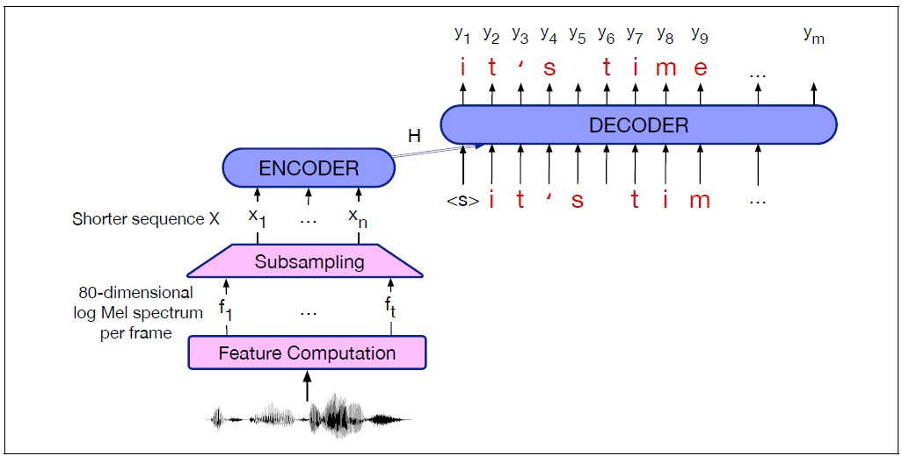
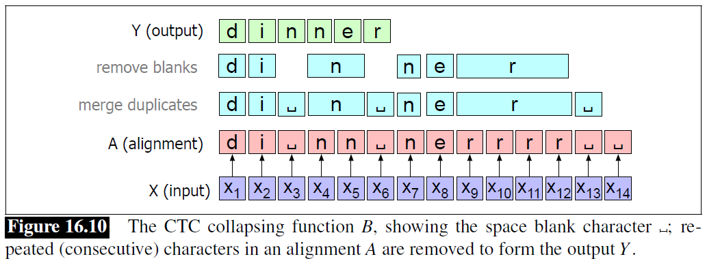
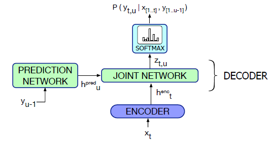
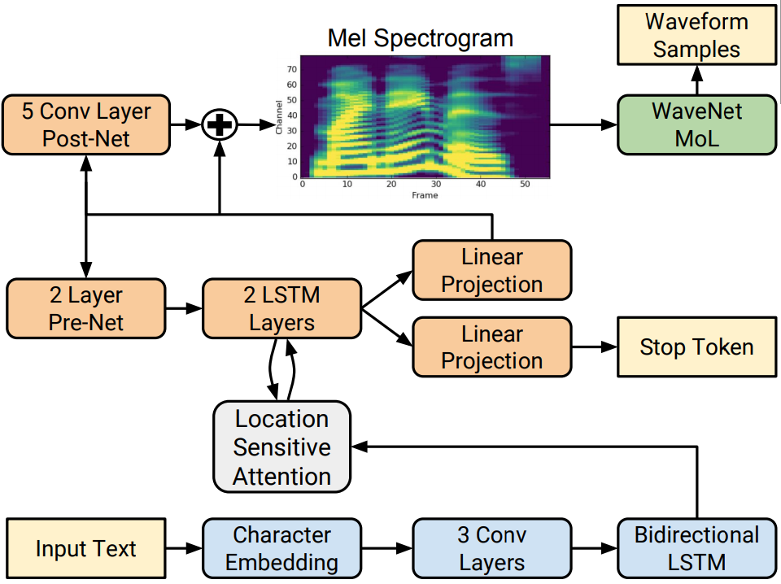
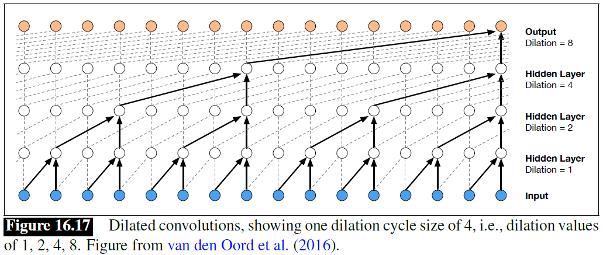

# Models

## Listen, Attend and Spell (LAS)

- Attention-based Encoder Decoder (AED)
- The input is a sequence of $t$ acoustic feature vectors $F = f_1, f_2, ..., f_t$, one vector per 10 ms frame
- The output can be letters or wordpieces
- The encoder-decoder architecture is appropriate when input and output sequences have stark length differences: very long acoustic feature sequences mapping to much shorter sequences of letters or words
- Encoder-decoder architecture for speech need to have a compression stage that shortens the acoustic feature sequence before the encoder stage; alternatively use CTC loss function
  - e.g. **Low frame rate algorithm:** for time $i$, concatenate the acoustic feature vector $f_i$ with the prior two vectors $f_{i-1}, f_{i-2}$

### Adding a LM

- Since an encoder-decoder model is essentially a conditional language model, they implicitly learn a language model for the output domain of letters from their training data
- Speech-text datasets are much smaller than pure text datasets
- We can usually improve a model at least slightly by incorporating a very large language model

### Beam Search

$$score(Y|X) = \frac{1}{|Y|_c} \log{P(Y|X)} + \lambda \log{P_{LM}(Y)}$$

- To get a final beam of hypothesized sentences, a.k.a n-best list
- The scoring is done by interpolating the LM score and encoder-decoder score, with a weight $\lambda$ tune on the held-out set
- Since most models prefer shorter sentences, normalize the probability by the number of characters in the hypothesis $|Y|_c$

## Connectionist Temporal Classification (CTC)

- The intuition of CTC is to output a single character for every frame of the input, so that the output is the same length as the input
- And then to apply a collapsing function that combines sequences of identical letters, resulting in a shorter sequence
- The CTC collapsing function is many-to-one; lots of different alignments map to the same output string

### Inference

- The most probable output sequence $Y$ is the one that has, not the single best CTC alignment, but the highest sum over the probability of all its possible alignments:

$$P_{CTC}(Y|X) = \sum_{A \in B^{-1}(Y)}{P(A|X)} = \sum_{A \in B^{-1}(Y)}{\prod_{t=1}^{T}{p(a_t|h_t)}}$$

$$\hat{Y} = \argmax_{Y}{P_{CTC}{(Y|X)}}$$

- Because of the strong conditional independence assumption (given the input, the output at time $t$ is independent of the output at time $t-1$), CTC does not implicitly learn a language model
- Essential using CTC to interpolate a language model

### Training

The loss for an entire dataset $D$ is the sum of the negative log-likelihoods of the correct output $Y$ for each input $X$:

$$ L_{CTC} = \sum_{(X,Y) \in D}{-\log{P_{CTC}(Y|X)}} $$

## RNN-Transducer (RNN-T)

- Because of the strong independence assumption in CTC, recognizers based on CTC don't achieve as high an accuracy as the attention-based encoder-decoder recognizers
- CTC recognizers have the advantage of streaming, recognizing words on-line rather than waiting until the end of the sentence to recognize them
- Removes the conditional independence assumtpion
- **Two main components:** a CTC acoustic model, and a separate language model component called the predictor that conditions on the output token history
- At each time step $t$, the CTC encoder outputs a hidden state $h_{t}^{\text{enc}}$ given the input $x_1 \dots x_t$
- The language model predictor takes as input the previous output token, outputting a hidden state $h_{t}^{\text{pred}}$
- The two hidden states are passed through the joint network, whose output is then passed through a softmax to predict the next character

## Tacotron2

- Extends the earlier Tacotron architecture and the Wavenet vocoder
- An encoder-decoder maps from graphemes to mel spectograms, followed by a vocoder that maps to wavefiles
- Location-based attention, in which the computation of the $$\alpha$$ values makes use of the $$\alpha$$ values from the prior time-state
- Autoregressively predict one 80-dimensional log-mel filterbank vector frame (50 ms, with a 12.5 ms stride) at each step
- Stop token prediction, decision about whether to stop producing output
- Trained on gold log-mel filterbank features, using teacher forcing

## WaveNet

- An autoregressive network
- Takes spectograms as input and produces output represented as sequences of 8-bit $\mu$-law audio samples
- This means that we can predict the value of each sample with a simple 256-way categorical classifier

The probability of a waveform, a sequence of 8-bit mu-law values $Y = y_1, \dots, y_t$, given an intermediate input mel spectogram $h$ is computed as:

$$ p(Y) = \prod_{t=1}^{t}{P(y_t | y_1,\dots, y_{t-1}, h_1, \dots, h_t)} $$

- The probability distribution is modeled by dilated convolution, a subtype of causal convolutional layer
- Dilated convolutions allow the vocoder to grow the receptive field exponentially with depth

