# Document OCR

**GitHub Repository:** [https://github.com/junwai7159/Document-OCR](https://github.com/junwai7159/Document-OCR)

## About this Project

This project is part of the SJTU ICE4309 - Image Processing & Content Analysis course.

We implemeted an 3-stage Optical Character Recognition (OCR) framework for converting in-the-wild documents to digitally readable and recognizable text.

## Architecture of Document OCR

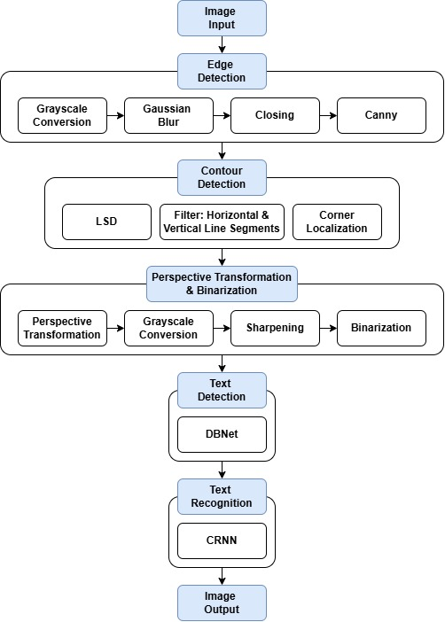

### First Stage: Preprocessing

- The images undergo preprocessing, including edge detection, contour detection, perspective transformation and binarization to further enhance the image.

### Second Stage: Text Detection

- The text detection module uses the DBNet model with MobileNetV3 as the backbone network.

### Third Stage: Text Recognition

- The text recognition module uses the CRNN model with MobileNetV3 as the backbone network.

## Results Visualization

### Edge Detection

| Input Image | Grayscale Conversion | Gaussian Blur | Closing | Canny |
| --- | --- | --- | --- | --- |
| 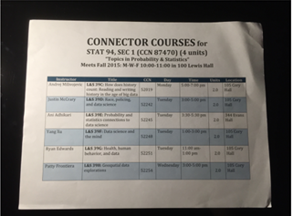 |  | 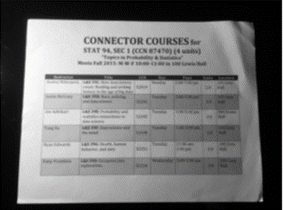 | 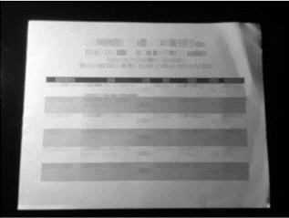 |  |

### Contour Detection

| LSD | Horizontal Line Segments | Vertical Line Segments | Final Contour |
| --- | --- | --- | --- |
| 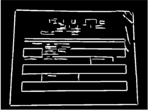 | 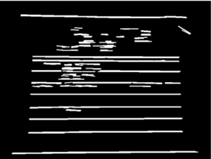 | 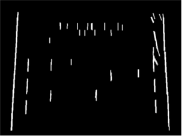 | 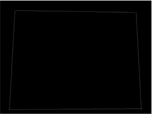 |

### Perspective Transformation & Binarization

| Perspective Transformation | Binarization |
| --- | --- |
| 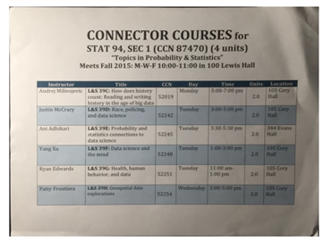 | 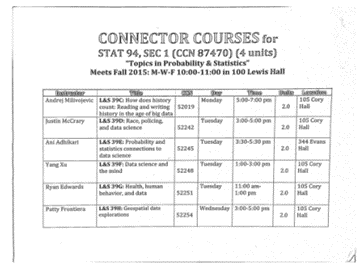 |

### Text Detection & Recognition

| Text Detection | Text Recognition |
| --- | --- |
| 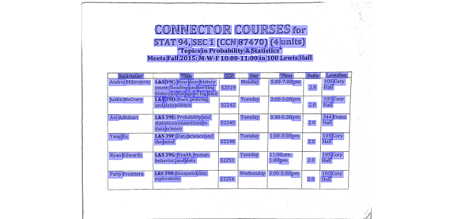 | 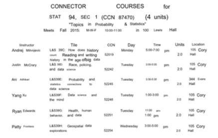 |
